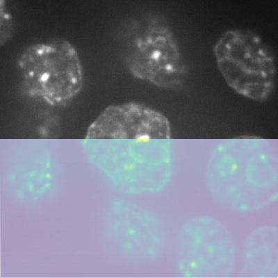
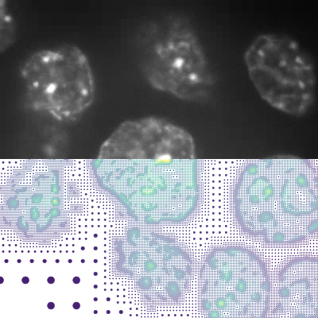
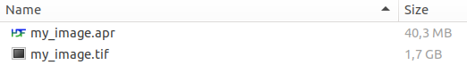
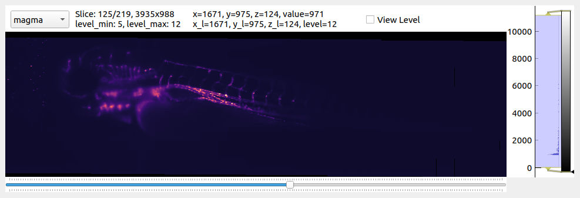
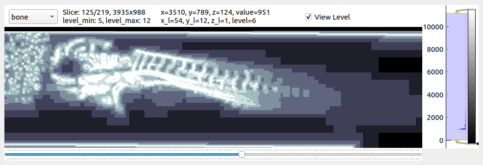
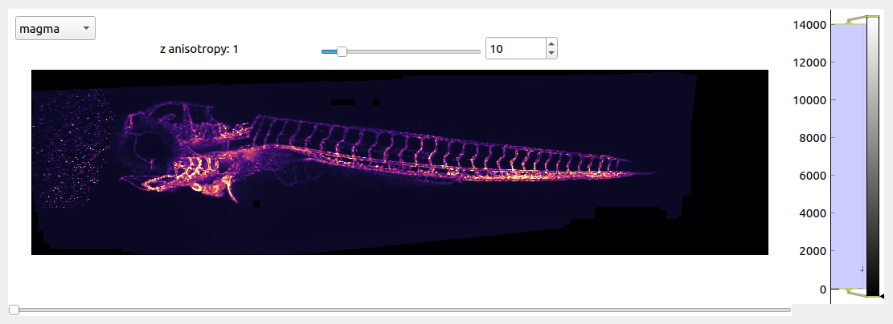

# pyapr

[](https://github.com/AdaptiveParticles/pyapr/actions)
[](https://codecov.io/gh/AdaptiveParticles/pyapr)
[](https://raw.githubusercontent.com/AdaptiveParticles/pyapr/master/LICENSE)
[]((https://python.org))
[](https://pypi.org/project/pyapr/)
[](https://pepy.tech/project/pyapr)
[](https://doi.org/10.5281/zenodo.7304045)

Documentation can be found [here](https://adaptiveparticles.github.io/pyapr/index.html).

Content-adaptive storage and processing of large volumetric microscopy data using the Adaptive Particle Representation (APR).

The APR is an adaptive image representation designed primarily for large 3D fluorescence microscopy datasets. By replacing pixels with particles positioned according to the image content, it enables orders-of-magnitude compression of sparse image data while maintaining image quality. However, unlike most compression formats, the APR can be used directly in a wide range of processing tasks - even on the GPU!

| Pixels | APR |
| :--: | :--: |
|  |  |
| Uniform sampling | Adaptive sampling |

*[image source](https://bbbc.broadinstitute.org/bbbc/BBBC032), 
[illustration source](https://ieeexplore.ieee.org/abstract/document/9796006)*


For more detailed information about the APR and its use, see:
- [Adaptive particle representation of fluorescence microscopy images](https://www.nature.com/articles/s41467-018-07390-9) (nature communications)
- [Parallel Discrete Convolutions on Adaptive Particle Representations of Images](https://ieeexplore.ieee.org/abstract/document/9796006) (IEEE Transactions on Image Processing)

**pyapr** is built on top of the C++ library [LibAPR] using [pybind11].

## Quick start guide

Convert images to APR using minimal amounts of code (*see [get_apr_demo](demo/get_apr_demo.py) and [get_apr_interactive_demo](demo/get_apr_interactive_demo.py) for additional options*).

```python
import pyapr
from skimage import io

# read image into numpy array
img = io.imread('my_image.tif')

# convert to APR using default settings
apr, parts = pyapr.converter.get_apr(img)

# write APR to file
pyapr.io.write('my_image.apr', apr, parts)
```



To return to the pixel representation:
```python
# reconstruct pixel image
img = pyapr.reconstruction.reconstruct_constant(apr, parts)
```


Inspect APRs using our makeshift image viewers (*see [napari-apr-viewer] for less experimental visualization options*).

```python
# read APR from file
apr, parts = pyapr.io.read('my_image.apr')

# launch viewer
pyapr.viewer.parts_viewer(apr, parts)
```


The `View Level` toggle allows you to see the adaptation (brighter = higher resolution).



Or view the result in 3D using APR-native maximum intensity projection raycast (cpu).
```python
# launch raycast viewer
pyapr.viewer.raycast_viewer(apr, parts)
```


See the [demo scripts] for more examples.

## Installation
For Windows 10, OSX, and Linux direct installation with OpenMP support should work via [pip]:
```
pip install pyapr
```
Note: Due to the use of OpenMP, it is encouraged to install as part of a virtualenv.

See [INSTALL] for manual build instructions.


## License

**pyapr** is distributed under the terms of the [Apache Software License 2.0].


## Issues

If you encounter any problems, please [file an issue] with a short description. 

## Contact us

If you have a project or algorithm in which you would like to try using the APR, don't hesitate to get
in touch with us. We would be happy to assist you!


[LibAPR]: https://github.com/AdaptiveParticles/LibAPR
[pybind11]: https://github.com/pybind/pybind11
[pip]: https://pypi.org/project/pip/
[INSTALL]: INSTALL.md
[demo scripts]: demo
[napari]: https://napari.org
[napari-apr-viewer]: https://github.com/AdaptiveParticles/napari-apr-viewer
[Apache Software License 2.0]: http://www.apache.org/licenses/LICENSE-2.0
[file an issue]: https://github.com/AdaptiveParticles/pyapr/issues
